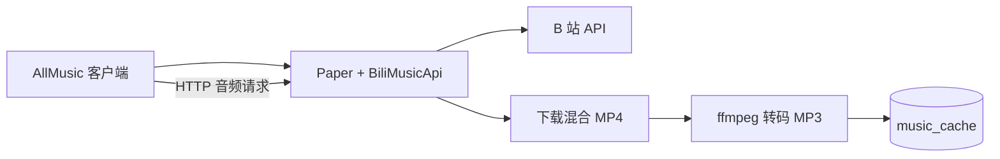

# AllMusic Bilibili 音乐源

为 [AllMusic](https://github.com/Coloryr/AllMusic) 提供 B 站视频搜索、点歌和音频播放能力。

## 目录

- [特性和工作流程](#特性和工作流程)
- [快速开始](#快速开始)
- [配置摘要](#配置摘要)
- [HTTP 音频服务](#http-音频服务)
- [故障排查](#故障排查)

## 特性

- 使用 B 站搜索 API 查找视频并返回 AllMusic 搜索结果。
- 服务端使用 ffmpeg 将 B 站混合 MP4 转换为纯 MP3。
- MP3 文件写入本地缓存，重复点歌无需再次下载和转码。
- 支持 Linux、macOS 和 Windows。
- 支持配置重载、缓存大小限制、音频时长限制和详细调试日志。
- 通过插件内置 HTTP 服务直接向客户端提供音频文件，不提供反向代理或 HTTPS。

## 工作流程



B 站在部分云服务器网络环境下无法稳定提供 DASH 纯音频流，因此本项目采用“下载混合 MP4 → 服务端转码”的方案。客户端最终只接收 MP3，兼容性更好。

## 前置要求

- Paper 服务器和 AllMusic 4.x。
- Java 21 或更高版本。
- ffmpeg，并确保服务进程可以执行 `ffmpeg -version`。

## 快速开始

### 1. 准备依赖

项目已包含从 `netapi` 获取的 AllMusic 宿主 API，构建会直接使用项目内 `libs/` 目录中的 JAR：

```text
libs/server-4.2.0-all.jar
```

`gson` 和 Adventure API 由 Gradle 从配置的 Maven 镜像下载。宿主 API 不会在构建时联网下载；如果宿主版本更新，请同步替换 `libs/server-4.2.0-all.jar`。

### 2. 构建 API

Linux/macOS：

```bash
./gradlew clean build
```

Windows：

```bat
gradlew.bat clean build
```

构建产物：

```text
build/libs/bili-api.jar
```

Gradle Wrapper 会自动下载 Gradle，不需要单独安装 Gradle。

### 3. 安装 API

将构建产物复制到 AllMusic 的 API 目录：

```bash
cp build/libs/bili-api.jar <server>/plugins/allmusic/api/
```

Windows 可以直接复制文件。

### 4. 配置 BiliMusicApi

启动一次 Paper 后编辑：

```text
<server>/plugins/allmusic/api/bili.json
```

至少填写 `serveUrl`。完整配置和 Windows 路径示例见 [配置说明](docs/config.md)。

### 5. 配置 HTTP 音频服务

插件会将 `cacheDir` 根目录中的 MP3 文件通过内置 HTTP 服务提供出来。服务默认监听 `0.0.0.0:8090`，客户端访问格式为：

```json
"serveUrl": "http://your-public-ip:8090/"
```

最终音频地址为 `http://your-public-ip:8090/BVxxxx.mp3`。如果修改 `port`，`serveUrl` 的端口也必须同步修改。服务只允许根路径 MP3 文件，不提供目录浏览、路径前缀、反向代理或 HTTPS。

### 6. 设置默认音乐源

编辑 `<server>/plugins/allmusic/config.json`：

```json
{
  "defaultApi": "bili"
}
```

重启 Paper，确认控制台出现类似：

```text
[AllMusic]注册音乐API：bili
```

## 使用

玩家安装 Fabric + AllMusic Client 后，可以使用：

```text
/music search 歌名
/music <搜索结果编号>
/music list
/music stop
/music vote
```

首次点歌需要下载和转码，之后相同 BV 号会直接命中 MP3 缓存。

## 配置摘要

常用配置示例：

```json
{
  "cacheDir": "music_cache",
  "serveUrl": "http://your-public-ip:8090/",
  "port": 8090,
  "cleanupInterval": 60,
  "ffmpegPath": "ffmpeg",
  "maxAudioLength": 45,
  "maxCacheSize": 512,
  "quality": 6,
  "advanced": {
    "configVersion": 2,
    "debug": false,
    "listenAddresses": ["0.0.0.0"],
    "preserveMinutes": 5,
    "maxRetry": 3,
    "retryDelay": 1500
  }
}
```

排查问题时临时开启：

```json
"advanced": {
  "debug": true
}
```

修改后执行：

```text
/music reload
```

详细字段说明、启动条件和排障方法见 [docs/config.md](docs/config.md)。

## HTTP 音频服务

- `port` 默认 `8090`，非法值回退到 `8090`。
- `advanced.listenAddresses` 支持多个监听地址，默认 `["0.0.0.0"]`。
- `serveUrl` 必须是客户端可直连的 HTTP/HTTPS 根地址，并以 `/` 结尾。
- 使用 Cloudflare Tunnel 时，`serveUrl` 应填写 Tunnel 暴露的公网根地址，例如 `https://music.example.com/`；Tunnel 需要转发到插件监听端口。
- 项目不负责 TLS 终止、反向代理、鉴权或目录索引。

## 缓存和配置升级

- `maxCacheSize` 默认 `512 MB`，设置为 `0` 表示不限制。
- `cleanupInterval` 默认每 `60` 分钟执行一次清理。
- 启动和 `/music reload` 时会立即清理一次。
- `advanced.preserveMinutes` 默认保留最近 `5` 分钟内修改的 MP3。
- `advanced.configVersion` 由插件维护，缺失或不匹配时会递归补齐缺失配置并写回文件，不覆盖已有值。

## 故障排查

- **API 未加载**：检查 `serveUrl`、ffmpeg、缓存目录权限和 HTTP 端口占用。
- **访问返回 404**：确认 URL 是 `/BVxxxx.mp3`，不要添加 `/music` 等路径前缀。
- **首次播放较慢**：首次需要下载 MP4 并使用 ffmpeg 转码，之后会命中缓存。
- **搜索失败或限流**：适当增加 `advanced.maxRetry` 或 `advanced.retryDelay`，并临时开启 `advanced.debug`。
- **调试结束后**：将 `advanced.debug` 改回 `false` 并执行 `/music reload`。

## 已知限制

- 首次点歌需要下载和转码，耗时取决于视频大小、网络和 CPU。
- B 站搜索接口可能限流，项目提供可配置的重试次数和间隔。
- `/music test` 可能同步执行转码并阻塞主线程，建议使用真实播放流程验证。
- B 站音乐源暂不提供歌词和歌单。
- 不同网络环境下 B 站接口或视频地址可能出现限流、超时或不可达。

## 项目结构

```text
allmusic-bilibili/
├── build.gradle
├── settings.gradle
├── libs/
│   └── server-4.2.0-all.jar
├── gradlew
├── gradlew.bat
├── docs/
│   └── config.md
├── src/main/
│   ├── java/bili/
│   └── resources/version
└── README.md
```

## 许可证和相关项目

本项目使用 MIT License。

- [AllMusic](https://github.com/Coloryr/AllMusic)
- [netapi 网易云源](https://github.com/Coloryr/netapi)
- [AllMusic-Bilibili](https://github.com/xiaozhang0406/allmusic-bilibili)
