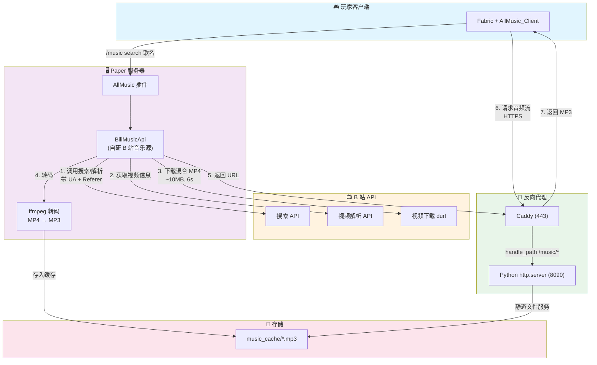
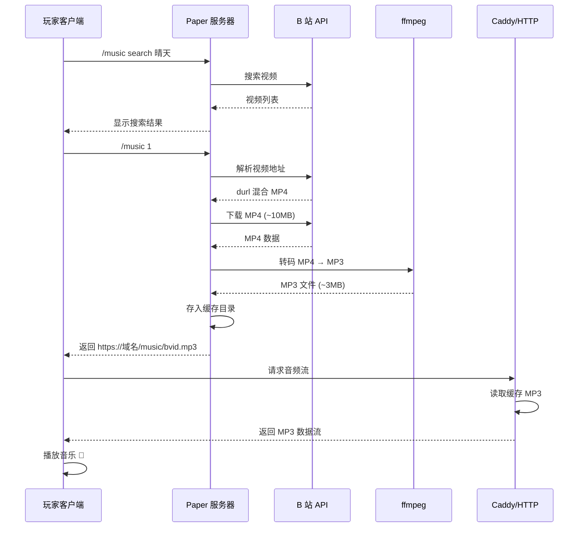

# AllMusic Bilibili 音乐源
# Windows用户请仔细查看配置介绍！！！！！！

让 [AllMusic](https://github.com/Coloryr/AllMusic) 插件支持 **Bilibili 视频点歌** 的完整解决方案。

> **背景**：AllMusic 官方只有网易云源（netapi），但网易云 weapi 接口对**云服务器 IP** 有风控（HTTP 200 返回空）。B 站虽然 API 可用，但 **DASH 纯音频接口对数据中心 IP 同样限流**（`fnval=16` 拿不到 audio），只能拿到**含视频轨的混合 MP4**——AllMusic 客户端（按纯音频设计）解不了这种文件。

**本项目解决了什么**：

1. 自研 AllMusic 音乐源 `BiliMusicApi`，实现 B 站视频搜索/解析/点歌
2. 服务端 **ffmpeg 转码**：把 B 站混合 MP4 转成纯 MP3，绕开"客户端解不了混合 MP4"的难题
3. 配套 HTTP 服务 + Caddy 反代，给客户端提供 HTTPS 音频流

---

## 架构



<details>
<summary>📊 简化流程图</summary>



</details>

**关键决策**：

- **为什么不用 DASH 纯音频**：B 站对数据中心 IP 的 DASH 接口限流（和网易云 weapi 一样），试了 `fnval=16/80/4048`、带 cookie、各种 UA 都拿不到 `audio`，只稳定返回 durl 混合 MP4
- **为什么服务端转码**：AllMusic 客户端 M4ADecoder 解含视频帧的混合 MP4 会错位（`invalid huffman codebook: 12`），且 `skip()` 跳视频块会断流。服务端转成纯 MP3 是最可靠的解法
- **为什么复用 443**：腾讯云安全组新增端口麻烦，用 Caddy `handle_path /music/*` 反代到本地 8090，客户端走已有 HTTPS

---

## 项目结构

```
allmusic-bilibili/
├── docs
│   └── config.md
├── LICENSE
├── README.md
└── server
    ├── scripts
    │   ├── Caddyfile
    │   └── music_server.py
    └── src
        └── main
            ├── java
            │   └── bili
            │       └── BiliMusicApi.java
            └── resources
                └── version
```

## 部署步骤

### 前置要求

- Paper 26.1.2（AllMusic 4.x）服务器
- Java 17+ 和 Python
- **ffmpeg**（服务端转码用）：`sudo apt install ffmpeg`
- （可选）Caddy（或任意反代）：`sudo apt install caddy`

### 1. 构建 B 站音乐源 jar

依赖：AllMusic server jar（`[paper]AllMusic_Server-*.jar`）+ gson + adventure-api

Linux / macOS

```bash
javac -cp "AllMusic_Server.jar:gson.jar:adventure-api.jar" -encoding UTF-8 -d out server/src/main/java/bili/*.java && cp server/src/main/resources/version out/ && cd out && jar cf ../bili-api.jar . && cd ..
```

Windows

```cmd
javac -cp "AllMusic_Server.jar;gson.jar;adventure-api.jar" -encoding UTF-8 -d out server\src\main\java\bili\*.java && copy server\src\main\resources\version out\ && cd out && jar cf ..\bili-api.jar . && cd ..
```

### 2. 放入 AllMusic 的 api 目录

```bash
cp bili-api.jar <server>/plugins/allmusic/api/
```

Win用鼠标拖一下就行了()

### 3. 配置

- [详细配置介绍](https://github.com/su-yihong/allmusic-bilibili/blob/master/docs/config.md)

### 4. 音乐 HTTP 服务

```bash
# 复制脚本，改端口/目录后注册为 systemd 服务
python3 server/scripts/music_server.py
```

systemd 服务示例：

```ini
[Unit]
Description=Music HTTP Server for AllMusic
After=network.target

[Service]
Type=simple
User=minecraft
Group=minecraft
WorkingDirectory=/home/minecraft
ExecStart=/usr/bin/python3 /home/minecraft/music_server.py
Restart=on-failure

[Install]
WantedBy=multi-user.target
```

### 5. Caddy 反代

参考 `server/scripts/Caddyfile`：

```caddy
your-domain.com {
	handle_path /music/* {
		reverse_proxy 127.0.0.1:8090
	}
	reverse_proxy 127.0.0.1:8080   # 你的其他服务
}
```

### 6. 配置默认音乐源

编辑 `<server>/plugins/allmusic/config.json`：

```json
{ "defaultApi": "bili" }
```

### 7. 重启服务器

重启 Paper 让 AllMusic 重新扫描 api 目录：

验证：控制台日志应出现 `[AllMusic]注册音乐API：bili`


## 使用

玩家装好 Fabric + AllMusic Client mod 后，进服：

```
/music search 歌名      # 搜 B 站视频
/music <数字>            # 点歌（第一首要等 ~12秒，含下载+转码）
/music list / stop / vote  # 播放控制
```

> 同曲目二次点歌**秒回**（已缓存 MP3）。

---

## 已知限制

- **点歌首次有延迟**：服务端要下载 MP4（~6s）+ 转码（~6s），第一首约 12 秒后开始播
- **搜索有频率限制**：B 站搜索 API 对连续请求限流，已内置 4 次重试 + 1.5s 间隔
- **`/music test` 会卡主线程**：AllMusic 的 CommandTest 同步调 getPlayUrl，转码时主线程阻塞触发 Paper watchdog（真实播放走异步线程不受影响）
- **B 站无歌词**：`getLyric` 返回空
- **B 站无歌单**：`setList` 暂不支持

---

## 本Fork的修改

- 1.环境变量改成配置文件
- 2.增加缓存清理功能
- 3.增加可点视频时长限制，以免过长的音频导致一直卡在转码
- 4.让转码质量能够直接在配置修改，以免糟糕的音质伤害人耳
- 5.Win上也能用

## License

MIT

## 相关

- [AllMusic (Coloryr/AllMusic)](https://github.com/Coloryr/AllMusic)
- [netapi 网易云源](https://github.com/Coloryr/netapi)
- [AllMusic-Bilibili](https://github.com/xiaozhang0406/allmusic-bilibili)

